<div align="center">

# Agent Lore

**Learn the agents. Pick the model. Ship the skill.**

[![Live][badge-site]][url-site]
[![HTML5][badge-html]][url-html]
[![CSS3][badge-css]][url-css]
[![JavaScript][badge-js]][url-js]
[![Claude Code][badge-claude]][url-claude]
[![License][badge-license]](LICENSE)

</div>

---

## Overview

**Agent Lore** is a working reference for developers who use AI agents seriously. It covers the tools people actually run — **Claude Code**, **Cursor**, and **local AI stacks** — and answers the three questions that come up over and over: *how do I do this*, *which model should I use and what will it cost*, and *how do I make this reliable enough to trust*.

Three sections, one for each question:

| | |
|---|---|
| **The Path** | 66 practical guides across 11 categories, organised into four training tracks — from installing a tool to running agents you can trust. |
| **The Codex** | 13 models compared on context, capability and real price, with a cost calculator, a routing guide, and the levers that actually move a bill. Every price carries the date it was verified against the provider's own documentation. |
| **The Armory** | How to build agent skills that stay right — grounded in sources you control rather than in what the model half-remembers. Four working templates included. |

Every guide is a real page at its own URL, readable without JavaScript, with prev/next across the whole corpus so you are never at a dead end.

**Live:** [agentlore.neorgon.com](https://agentlore.neorgon.com/)

## Features

- **66 guides** across Setup, Context, Cost, Skills, Commands, MCPs, Architecture, Evaluation, Tips, Diagrams and Local AI
- **Model comparison** — sortable matrix of context windows, input/output/cache pricing, and what each model is genuinely good and bad at
- **Cost calculator** — pick a workload shape, adjust it, and see monthly spend across models side by side, with local break-even
- **Dated pricing** — every row stamped with its verification date and source link; the UI flags anything past its re-check window
- **Price-change warnings** — scheduled provider changes surface as a countdown before they hit your bill
- **Command palette** — `/` or `⌘K` across guides, models, skill patterns and a 28-term glossary
- **Static reader pages** — one indexable HTML page per guide, no JavaScript required to read
- **Four training tracks** — Core Agent Skills, Cost & Efficiency, Reliable Agents, Local AI, with progress tracking shared across the whole site
- **Shareable filters** — browse state lives in the URL
- **Keyboard navigation** — `←`/`→` between guides, `/` to search, one-key copy on every code block

## Running locally

```bash
make serve    # → http://localhost:8818
```

ES modules require an HTTP server -- `file://` won't work.

After editing anything under `js/content/`, regenerate the static pages:

```bash
make pages
```

## Architecture

Two rendering surfaces sharing one renderer, so they cannot drift.



```
agentlore-site/
├── index.html              # App shell — hash-routed SPA
├── t/<id>/index.html       # Generated reader pages (one per guide, committed)
├── css/
│   └── style.css           # Tokens, components, prose, responsive
├── js/
│   ├── app.js              # Entry point
│   ├── router.js           # Route → view dispatch
│   ├── state.js            # Routing, filters, progress, localStorage
│   ├── events.js           # Delegated handlers
│   ├── palette.js          # Command palette (shell + reader pages)
│   ├── reader.js           # Reader-page script: progress, outline, keyboard nav
│   ├── utils.js            # renderMarkdown, formatting, clipboard
│   ├── views/              # home · browse · learn · codex · calculator · armory
│   └── content/
│       ├── index.js        # Taxonomy, aggregation, prev/next
│       ├── paths.js        # Training tracks
│       ├── models.js       # Model reference with verified prices
│       ├── workloads.js    # Calculator presets + cost formula
│       ├── armory.js       # Skill patterns and templates
│       ├── glossary.js     # Glossary, feeds the palette
│       └── tutorials/      # One file per category
├── scripts/
│   ├── build-pages.mjs     # Generates reader pages, search index, sitemap, llms.txt
│   └── claude-costs.py     # Standalone session cost report
├── search-index.json       # Generated — lazy-loaded by the palette
├── sitemap.xml             # Generated
├── llms.txt                # Generated
├── Makefile                # PORT = 8818
└── CNAME                   # agentlore.neorgon.com
```

`scripts/build-pages.mjs` imports the site's own `renderMarkdown` rather than reimplementing it — the generated page and the in-app rendering come from the same code. Output is committed, so serving stays zero-build.

## A note on the pricing data

Model prices are taken from each provider's own pricing documentation and stamped with the date they were checked. They will go out of date. The site is built to make that visible rather than hide it: every row carries a `verified` date, the page shows how long ago that was, and anything past 90 days is flagged as stale.

Always confirm at the source before you budget. The links are on the page.

---

<div align="center">

Part of [Neorgon](https://neorgon.com/)

</div>

<!-- Badge links -->
[badge-site]:    https://img.shields.io/badge/live_site-0063e5?style=for-the-badge&logo=googlechrome&logoColor=white
[badge-html]:    https://img.shields.io/badge/HTML5-E34F26?style=for-the-badge&logo=html5&logoColor=white
[badge-css]:     https://img.shields.io/badge/CSS3-1572B6?style=for-the-badge&logo=css3&logoColor=white
[badge-js]:      https://img.shields.io/badge/JavaScript-F7DF1E?style=for-the-badge&logo=javascript&logoColor=black
[badge-claude]:  https://img.shields.io/badge/Claude_Code-CC785C?style=for-the-badge&logo=anthropic&logoColor=white
[badge-license]: https://img.shields.io/badge/license-MIT-404040?style=for-the-badge

[url-site]:   https://agentlore.neorgon.com/
[url-html]:   #
[url-css]:    #
[url-js]:     #
[url-claude]: https://claude.ai/code
